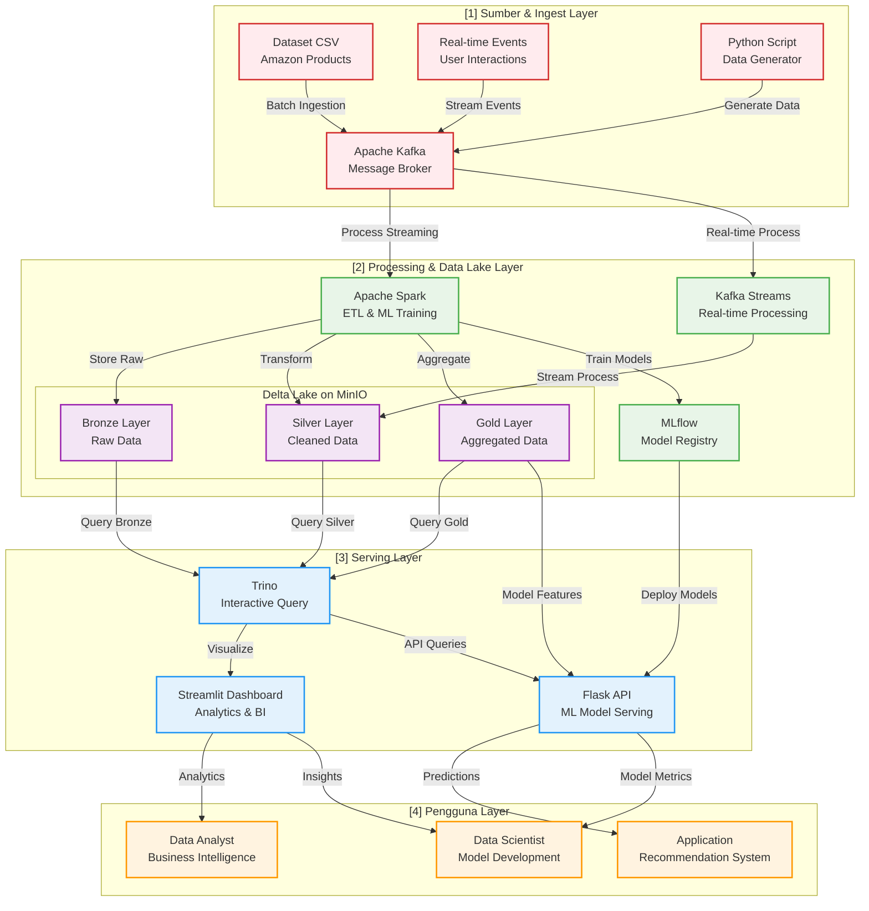

# FP_BigData

**Kelompok 10**

| Nama                      | NRP        |
| ------------------------- | ---------- | 
| Johanes Edward Nathanael  | 5027231067 |
| Abhirama Triadyatma H     | 5027231061 |
| Rama Owarianto            | 5027231049 |

## Overview
Building an intelligent e-commerce analytics platform using modern data lakehouse architecture to create advanced product recommendation systems and business intelligence capabilities.

## Dataset

Source: [Amazon Products Dataset 2023](https://www.kaggle.com/datasets/asaniczka/amazon-products-dataset-2023-1-4m-products?select=amazon_products.csv).

Scale: 1.4 Million products

## Arsitektur

## Tech Stack
