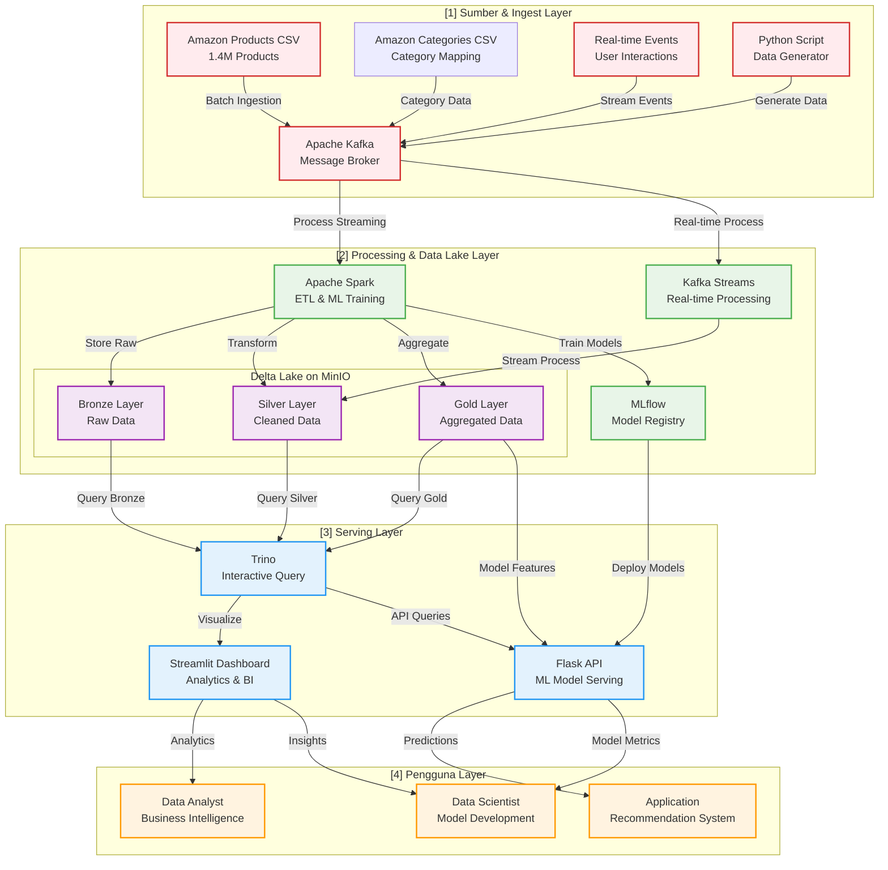

# FP_BigData

**Kelompok 10**

| Nama                      | NRP        |
| ------------------------- | ---------- | 
| Johanes Edward Nathanael  | 5027231067 |
| Abhirama Triadyatma H     | 5027231061 |
| Rama Owarianto            | 5027231049 |

## Overview
Building an intelligent e-commerce analytics platform using modern data lakehouse architecture to create advanced product recommendation systems and business intelligence capabilities.

## Dataset

Source: [Amazon Products Dataset 2023](https://www.kaggle.com/datasets/asaniczka/amazon-products-dataset-2023-1-4m-products?select=amazon_products.csv).

Scale: 1.4 Million products

## Arsitektur



## Tech Stack
Tech stack yang dipilih:

    - Python (FastAPI) untuk backend
    - PostgreSQL untuk database
    - Kafka + Zookeeper untuk streaming pipeline
    - Semua dijalankan melalui Docker Compose

Kita sudah siapkan dan jalankan docker-compose.yml:
    
    - Container: app, postgres, zookeeper, kafka
    - Service dependencies sudah ditentukan

Folder app/ diisi:

    - main.py → menjalankan FastAPI
    - database.py → koneksi ke PostgreSQL
    - config.py → load .env via BaseSettings
    
## EDA

```
🔍 Amazon Products Dataset Exploration
==================================================
✅ Products dataset loaded successfully!
   Shape: (1426337, 11)
✅ Categories dataset loaded successfully!
   Shape: (248, 2)

============================================================
📊 PRODUCTS DATASET ANALYSIS
============================================================
Dataset Info:
├── Shape: (1426337, 11)
├── Size: 655.68 MB
└── Columns (11): ['asin', 'title', 'imgUrl', 'productURL', 'stars', 'reviews', 'price', 'listPrice', 'category_id', 'isBestSeller', 'boughtInLastMonth']

Data Types:
├── asin: object
├── title: object
├── imgUrl: object
├── productURL: object
├── stars: float64
├── reviews: int64
├── price: float64
├── listPrice: float64
├── category_id: int64
├── isBestSeller: bool
├── boughtInLastMonth: int64

Missing Values:
├── title: 1 (0.0%)

Duplicate Rows: 0

📋 Sample Products Data (First 5 rows):
         asin                                              title                                             imgUrl  ... category_id  isBestSeller  boughtInLastMonth
0  B014TMV5YE  Sion Softside Expandable Roller Luggage, Black...  https://m.media-amazon.com/images/I/815dLQKYIY...  ...         104         False               2000
1  B07GDLCQXV  Luggage Sets Expandable PC+ABS Durable Suitcas...  https://m.media-amazon.com/images/I/81bQlm7vf6...  ...         104         False               1000
2  B07XSCCZYG  Platinum Elite Softside Expandable Checked Lug...  https://m.media-amazon.com/images/I/71EA35zvJB...  ...         104         False                300
3  B08MVFKGJM  Freeform Hardside Expandable with Double Spinn...  https://m.media-amazon.com/images/I/91k6NYLQyI...  ...         104         False                400
4  B01DJLKZBA  Winfield 2 Hardside Expandable Luggage with Sp...  https://m.media-amazon.com/images/I/61NJoaZcP9...  ...         104         False                400

[5 rows x 11 columns]

============================================================
🏷️ CATEGORIES DATASET ANALYSIS
============================================================
Dataset Info:
├── Shape: (248, 2)
├── Size: 0.02 MB
└── Columns (2): ['id', 'category_name']

Data Types:
├── id: int64
├── category_name: object

Missing Values:

📋 Sample Categories Data (First 10 rows):
   id                     category_name
0   1          Beading & Jewelry Making
1   2                 Fabric Decorating
2   3       Knitting & Crochet Supplies
3   4              Printmaking Supplies
4   5  Scrapbooking & Stamping Supplies
5   6                   Sewing Products
6   7              Craft & Hobby Fabric
7   8               Needlework Supplies
8   9     Arts, Crafts & Sewing Storage
9  10  Painting, Drawing & Art Supplies

============================================================
🔗 RELATIONSHIP ANALYSIS
============================================================
Analyzing relationship between products and categories...
Common columns: set()
Potential linking columns in products: ['category_id']

============================================================
📈 STATISTICAL SUMMARY
============================================================
Products - Numerical columns summary:
              stars       reviews         price     listPrice   category_id  boughtInLastMonth
count  1.426337e+06  1.426337e+06  1.426337e+06  1.426337e+06  1.426337e+06       1.426337e+06
mean   3.999512e+00  1.807508e+02  4.337540e+01  1.244916e+01  1.237409e+02       1.419823e+02
std    1.344292e+00  1.761453e+03  1.302893e+02  4.611198e+01  7.311273e+01       8.362720e+02
min    0.000000e+00  0.000000e+00  0.000000e+00  0.000000e+00  1.000000e+00       0.000000e+00
25%    4.100000e+00  0.000000e+00  1.199000e+01  0.000000e+00  6.500000e+01       0.000000e+00
50%    4.400000e+00  0.000000e+00  1.995000e+01  0.000000e+00  1.200000e+02       0.000000e+00
75%    4.600000e+00  0.000000e+00  3.599000e+01  0.000000e+00  1.760000e+02       5.000000e+01
max    5.000000e+00  3.465630e+05  1.973181e+04  9.999900e+02  2.700000e+02       1.000000e+05

Products - Categorical columns (4):
├── asin: 1,426,337 unique values
    Top 3: {'B014TMV5YE': 1, 'B07GDLCQXV': 1, 'B07XSCCZYG': 1}
├── title: 1,385,430 unique values
    Top 3: {"Men's Sneaker": 89, 'mens Modern': 86, "Men's Ultraboost 23 Running Shoe": 83}
├── imgUrl: 1,372,162 unique values
    Top 3: {'https://m.media-amazon.com/images/I/01RmK+J4pJL._AC_UL320_.gif': 1130, 'https://m.media-amazon.com/images/I/41yRoNIyNwL._AC_UL320_.jpg': 427, 'https://m.media-amazon.com/images/I/618nc8YRRRL._AC_UL320_.jpg': 307}
├── productURL: 1,426,337 unique values
    Top 3: {'https://www.amazon.com/dp/B014TMV5YE': 1, 'https://www.amazon.com/dp/B07GDLCQXV': 1, 'https://www.amazon.com/dp/B07XSCCZYG': 1}

============================================================
💾 DATA SAMPLING FOR DEVELOPMENT
============================================================
✅ Created sample datasets:
├── Products sample: 100,000 rows
├── Categories: 248 rows
└── Saved to: C:\Users\jobir\Downloads\amazondataset\sample

============================================================
🎯 BIG DATA 5V's VALIDATION
============================================================
📊 Volume: 655.70 MB (1,426,337 products)
🎨 Variety: 4 different data types
⚡ Velocity: Real-time streaming capability (to be implemented)
✅ Veracity: 0.0% missing data
💎 Value: E-commerce analytics & recommendation system potential

============================================================
✅ EXPLORATION COMPLETE!
============================================================
```
